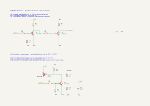
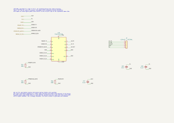
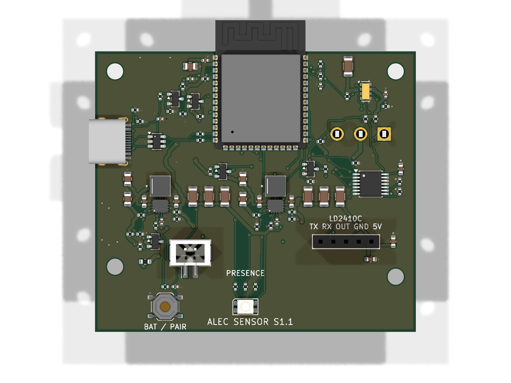
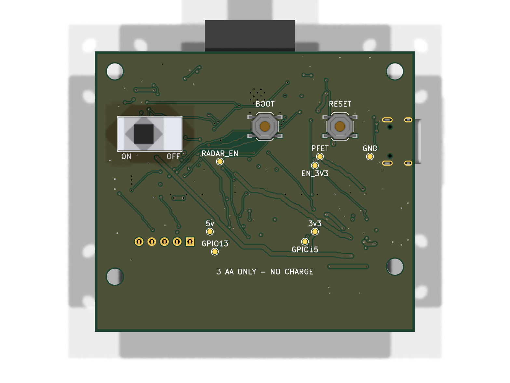

# ALEC Sensor

**S1.1 engineering prototype: fully routed 64 × 56 mm, four-layer PCB** for the separate shower presence sensor. It uses an ESP32-S3-WROOM-1-N16, RV-3028-C7 RTC, 3.3 V and switchable 5 V TPS63070 rails, an LD2410C socket, native USB-C data, one RGB LED and one battery/pairing button. Supply: three AA alkaline or **1.5 V primary lithium** cells. There is no battery charger.

The PCB is paired with a [116 mm diameter × 54 mm circular enclosure](../../enclosures/alec-sensor/). Its flat PCB, actual AA holder and vendor radar geometry are integrated in an editable Blender assembly. The enclosure is a nominal mechanical prototype, not a waterproof certification or tooling release.

- [Full S1.1 test report and remaining release gates](TEST-REPORT.md)
- [BOM with explicit ordering candidates](review/bom.csv), [GPIO/power/sleep contract](OPERATION.md)
- [Sources and part-selection notes](SOURCES.md), [enclosure interface](ENCLOSURE.md)
- [KiCad schematic](alec-sensor.kicad_sch), [PCB](alec-sensor.kicad_pcb), [project](alec-sensor.kicad_pro)
- [Rebuild and verification commands](tools/README.md)

Behind the removable rear cover, the cells load directly into the rear-facing holder; POWER, RESET and BOOT face that same opening beside it. The holder and PCB stay installed during routine service. [See the service bay](../../enclosures/alec-sensor/rear-service.png). Radar, RGB indication and the membrane-covered battery/pairing button face outward.

Both converter cells retain their reviewed positions, direct 0.4 mm capacitor connections and top-side switch-node copper. In1.Cu remains an uninterrupted signal-free ground reference. Sensor GPIO routing, power switching and mechanical integration are checked separately.

SW1 is a **6 A / 28 VDC** C&K hard battery disconnect; F1 is a **1.5 A fast SMD fuse** near J1. Its clearing behavior, inrush endurance and upstream holder-wire protection still require bench review. The radar's TX/RX/OUT lines pass through a default-open TMUX1511 so disabling 5 V does not leave a direct ESP32 signal path to the unpowered radar.

**Use a scheduled alarm window as the proposed normal mode.** Continuous radar + awake ESP32 is a battery-life experiment: with the illustrative 9 Wh usable pack, 85% efficiency, 79 mA radar and 80 mA MCU assumptions, runtime is about **11.6 hours**. At 30 minutes awake per day the same arithmetic gives about **22 days**. These are sensitivity estimates, not measured endurance. RTC wake works in deep sleep; ESP-NOW cannot wake a sleeping radio.

USB is data-only: battery power and SW1 ON are required to flash. Open and dry the unit for service; the battery carrier may need removal and the PCB may need to be lifted from its four mounts to insert a normal USB plug. Hard OFF or battery removal loses RTC time; resynchronize before arming.

<!-- board-images-start -->
## Board Images

_Auto-generated on merge to main._

### Schematic

[Download schematic PDF](docs/schematic.pdf)

### PCB 3D Views

| Top | Bottom |
| :---: | :---: |
|  |  |

[Download populated 3D model (GLB)](docs/assembly.glb) — open in Blender or a glTF viewer.

<!-- board-images-end -->
