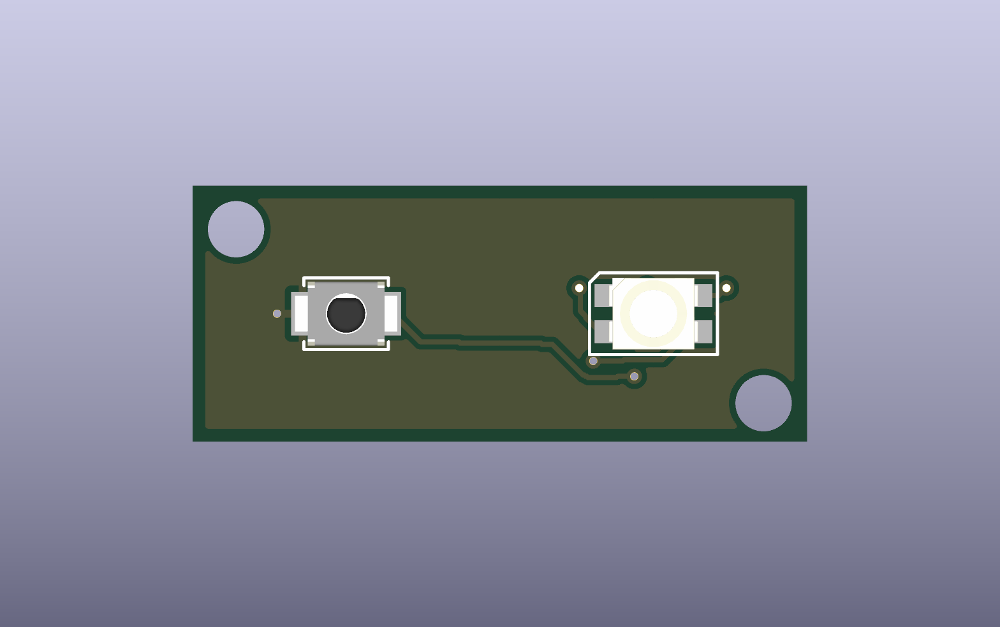
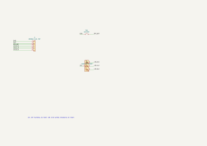
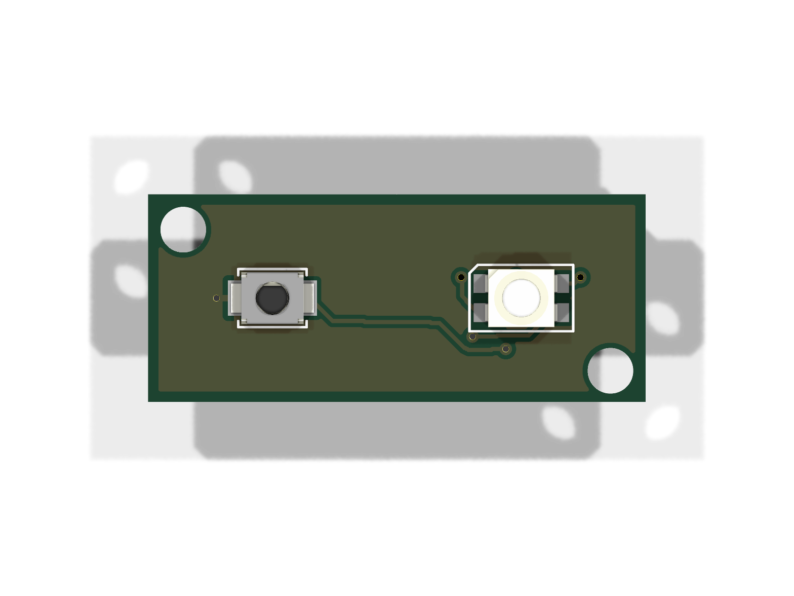
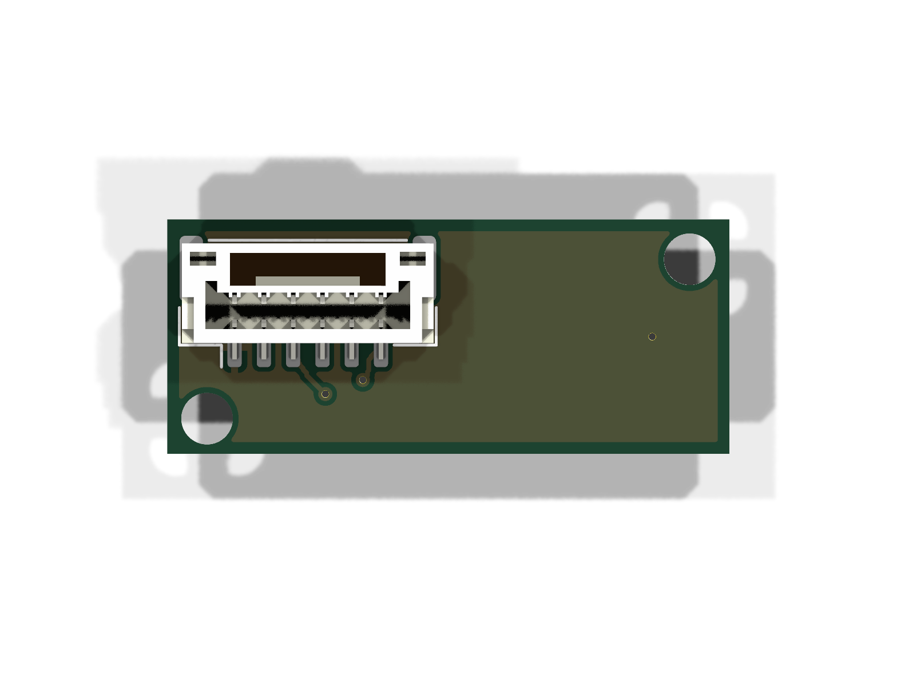

# Bedroom alarm front PCB

24 × 10 mm front board with Omron B3U-1000P battery-check switch and Wuerth 150141M173100 common-anode RGB LED. Two copper layers, 1.6 mm thickness. J1 faces inward on B.Cu. These are actual routed boards fitted to the [v4.2 enclosure](../../enclosures/bedroom-alarm/pcb-revision/README.md), with physical tolerance/assembly verification still pending.

[Connector side](review/pcb-bottom.png) · [Schematic PDF](review/schematic.pdf) · [Native schematic](bedroom-alarm-front.kicad_sch) · [Native PCB](bedroom-alarm-front.kicad_pcb) · [BOM](review/bom.csv)

See the [harness contract](../bedroom-alarm-main/HARNESS.md) and [test report](../bedroom-alarm-main/review/TEST-REPORT.md). Pullups, debounce capacitors, 100 Ω button series resistors and RGB resistors live on the main board. Do not connect this board directly to an unprotected ESP32 input in place of the defined main-board interface.

<!-- board-images-start -->
## Board Images

_Auto-generated on merge to main._

### Schematic

### PCB 3D Views

| Top | Bottom |
| :---: | :---: |
|  |  |

<!-- board-images-end -->
