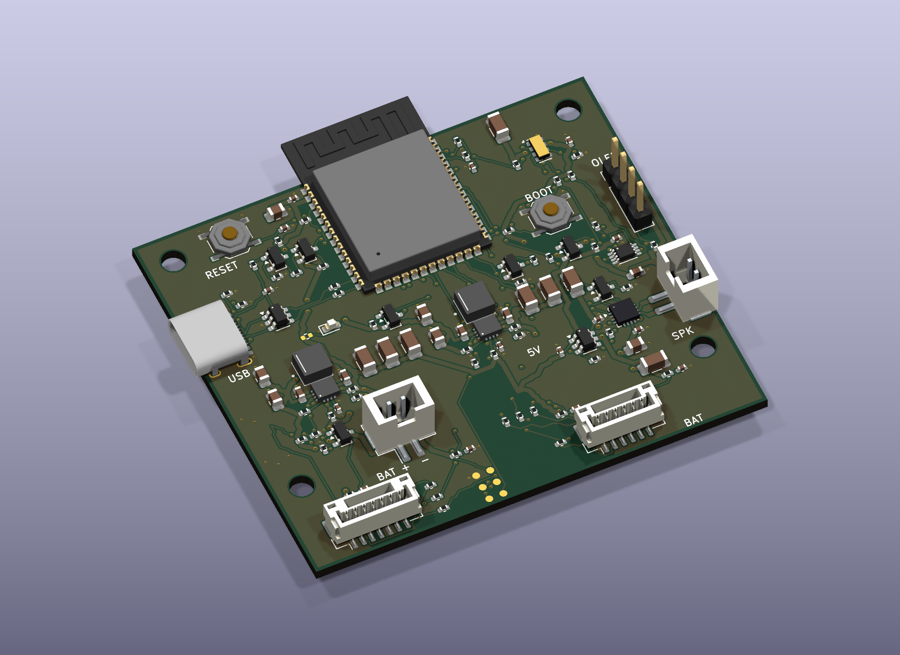

# Bedroom alarm main PCB

Enclosure-specific derivative of the reviewed ESP32-S3 dual-TPS63070 board. The 64 × 56 mm four-layer board retains the MCU, antenna overhang, USB, RTC, battery protection, switched display supply and MAX98357A audio path. User controls connect to two small daughterboards. This is a prototype; physical qualification and manufacturing release remain pending.

- [Schematic PDF](review/schematic.pdf) and [native schematic](bedroom-alarm-main.kicad_sch)
- [Native PCB](bedroom-alarm-main.kicad_pcb), [top view](review/pcb-top.png), [back view](review/pcb-bottom.png), [BOM](review/bom.csv)
- [Complete test report](review/TEST-REPORT.md), [SPICE report](review/spice-report.md)
- [Harness and programming contract](HARNESS.md)
- [Integrated v4.2 enclosure](../../enclosures/bedroom-alarm/pcb-revision/README.md)

J5 is the 7-pin bottom-controls interface; J6 is the 6-pin front-button/RGB interface. R50–R53 add 100 Ω in each remote button line. The old SW1/SW4–SW7/D2 are removed from this main board. J7 comprises six unpopulated UART probe pads, excluded from the BOM and placement file. RESET and BOOT remain local.

The converter and audio placement is inherited deliberately. Layout verification checks 1,094 retained power/return/USB/BTL track or via geometries and the four 1.81 mm local capacitor connections. A fresh reduced physical screening uses the revised filled copper; it does not establish junction temperature, emissions compliance or real switching stress.

Reproduce the design and checks with the [PCB tooling guide](../../scripts/alarm/README.md). The unchanged [bench-board project](../esp32s3-devkit-5v/README.md) remains available for comparison.
