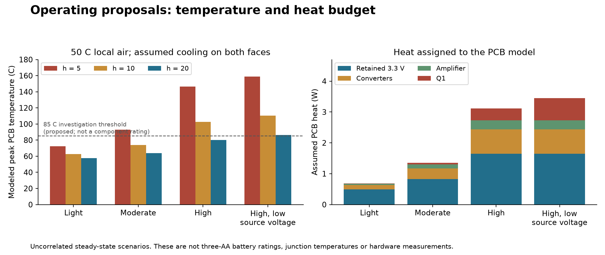

# Operating envelope and validation follow-up

6 September 2026, PR #122. **Three AA cells, alkaline or lithium, are now the
user's battery requirement.** The working connection is three in series.
Lithium results below conditionally refer to 1.5 V primary Li/FeS2 cells; the
exact lithium type, speaker requirement, enclosure and test equipment remain
pending in [operating-requirements.json](../../analysis/operating-requirements.json).

**Physical release remains open.** This update provides calculations, numerical
checks and a concrete [bench procedure](bench-plan.md). It does not contain
hardware measurements or an approved maximum continuous audio rating.

## What has been resolved in the analysis

- The input source now has a constant-power sag calculation, including all three
  cells, holder/wiring and Q1. The mathematical controls check power conservation
  and reject source collapse instead of silently returning a usable voltage.
- Q1 heat is included. In an isolated repeat of the earlier reference loss
  budget, adding 0.433 W at Q1 raises the modeled peak by **6.0 C**. Thus the
  earlier thermal report was incomplete as a total board heat budget.
- The location of delivered power is explicit. The new thermal proposals retain
  all 3.3 V power on the PCB and separate speaker power from amplifier loss.
- The bench plan specifies test pads, measurement modes, thermal stabilization,
  junction estimation, probing technique and evidence needed to close each gap.
- Local verification: **92 Python tests passed, one integration test skipped**.
  This includes 12 new power-budget tests. Existing report provenance also passes.

## Three-AA source results

The [30-case sweep](aa-battery-results.csv) uses manufacturer IR ranges as
**static sensitivity inputs**, not a validated electrochemical discharge model.
It includes a proposed 0.10 ohm holder/wire path and 0.13 ohm hot Q1 resistance.
Converter efficiency is assumed 85%, incremental amplifier efficiency 90%,
with 16.75 mW amplifier idle overhead. Fresh/nominal/depleted voltages are
proposed test points, not guaranteed bounds. See the
[scenario definitions](../../analysis/aa-battery-scenarios.json) and
[full calculated results](aa-battery-results.json).

The moderate load means 0.25 A at 3.3 V and 1 W audio output; high means 0.5 A
at 3.3 V and 2.5 W audio output. Audio wattage is a load assumption, not a promise
that the unselected speaker will receive that output at acceptable distortion.

| Example source case | Load | Battery current | Protected voltage | Implication within the static model |
| --- | --- | --- | --- | --- |
| Alkaline, 4.5 V, lower fresh IR | Moderate | 0.558 A | 4.121 V | Plausible candidate for measurement |
| Alkaline, 4.5 V, lower fresh IR | High | 1.504 A | 3.478 V | Much greater cell/Q1 heat and less voltage margin |
| Alkaline, 4.8 V, higher fresh IR | High | No solution | No solution | Assumed source cannot sustain the constant-power demand |
| Alkaline depleted sensitivity, 3.6 V | Moderate | 0.883 A | 2.602 V | Continued operation and restart must be assessed separately |
| Primary lithium, 4.5 V, lower IR | High | 1.430 A | 3.656 V | Requires actual pack, audio and temperature checks |
| Primary lithium, 4.5 V, higher IR | High | 2.044 A | 2.558 V | Exceeds the connector's 2 A specification in this scenario |

The [E91 datasheet](https://data.energizer.com/pdfs/e91.pdf) lists fresh nominal
IR of 150-300 milliohm per alkaline cell; the
[L91 datasheet](https://data.energizer.com/pdfs/l91.pdf) lists typical IR of
120-240 milliohm per primary lithium cell depending on method. Their measurement
methods and timescales differ. Neither constant IR nor these voltage points
predict battery runtime, aging or transient recovery. Do not interpret the
no-solution rows as observed failures of actual cells.

**Design implication:** support alkaline by validating it as a limiting source,
and test reduced-audio operation near depletion. Do not promise continuous loud
audio throughout battery life. A 3 V open-circuit pack is not 3 V at the regulator
under load. TPS63070 startup requires 3 V at VIN while VOUT is below 3 V;
staged enable and load-aware restart/low-battery policies need hardware validation.
[TPS63070 datasheet](https://www.ti.com/lit/ds/symlink/tps63070.pdf).

## Thermal proposals and missing Q1 loss

These four thermal proposals were run before the three-AA clarification and
retain their original **optimistic 0.20 ohm external source resistance**. They
are a heat/load comparison, not the chemistry-specific results above. Do not
combine their temperatures with a different battery case without recomputing
losses. All results use 50 C air immediately beside the PCB, fixed material
properties and the original assumed stackup. No enclosure or package temperature
model has been validated.

| Proposal | 3.3 V current | Audio output | PCB heat | Peak C, h=5 | Peak C, h=10 | Peak C, h=20 |
| --- | --- | --- | --- | --- | --- | --- |
| Light, 3.6 V source | 0.15 A | 0.25 W | 0.688 W | 72.3 | 62.6 | 57.6 |
| Moderate, 3.6 V source | 0.25 A | 1 W | 1.358 W | 92.8 | 73.7 | 64.0 |
| High, 3.6 V source | 0.5 A | 2.5 W | 3.116 W | 146.3 | 102.5 | 80.3 |
| High, 3.0 V source | 0.5 A | 2.5 W | 3.447 W | 158.7 | 110.5 | 86.3 |

h is the assumed coefficient on each board face in W/(m2 K), not a verified
enclosure property. The high/3.0 V row gives only 2.224 V at the protected node;
the fixed Q1 resistance then extrapolates below the cited -2.5 V gate-drive
condition. It is an out-of-envelope sensitivity, not a rated steady operating
point. Thermal values above a component's operating range likewise illustrate
concern; they are not validated high-temperature predictions.

The new 0.5 to 0.25 mm thermal refinement check changes the moderate/h=10 peak
rise by **2.37%**, passing the proposed 5% numerical target. This does not bound
the modeling error or establish convergence for every other case. All cases
conserve input heat within numerical precision.

The Q1 comparison holds seven package landing nodes, all other heat sources,
mesh and cooling fixed. It adds 0.433 W calculated for a 3.6 V source, 0.20 ohm
external resistance, 0.13 ohm Q1 and the old 4.65 W delivered load at 85%
conversion. Peak board rise changes from 33.395 C to 39.434 C. The difference
isolates this omitted heat source; it is not a new measured temperature or a
direct replacement for the earlier fine-grid old/new comparison.

All retained 3.3 V heat is applied at U3 as a stated location proxy. The thermal
solver treats package landing nodes as isothermal and omits internal package
paths and direct package cooling. Other small losses and transient/RMS effects
remain unmodeled. Speaker and battery loss may heat the enclosure even though
they are outside the PCB model. E91's 55 C and L91's 60 C upper operating
temperatures make the battery holder temperature an additional test point.

## Parasitic diagnostic

The C3 input loop was refined from 0.125 to 0.100 mm with the same physical
window, ports, stackup, one thickness filament and nine-frequency sweep. At
10 MHz, L changes from 0.6903 nH to 0.6922 nH and R from 4.7578 to 4.8378
milliohm. Both changes are below 5%. This is encouraging for this one step,
not proof that all four loops converge. The independent grid registration,
contact, via/thickness and final-stackup checks remain open.

Further refinement evidence is recorded in [mesh-diagnostic.json](mesh-diagnostic.json)
and the supplementary raw archive. The 0.080 mm C3 attempt **timed out after
1,200 seconds without a completed frequency point**. Its input deck and empty
matrix are retained. The original CLI did not save solver stdout on timeout;
the observed exception and incomplete status are recorded explicitly. Do not
replace the original eight-loop
failed convergence gate with a pass based on this one C3 diagnostic. Actual
ringing and EMI still require adequately resolved measurements.

## Reproduce and continue

The [runbook](../../../../scripts/qualification/README.md) explains how to rerun
the free calculations. [Thermal/power results](operating-envelope-results.json),
[CSV](operating-envelope-results.csv), the battery sweep, and
[raw numerical evidence](operating-envelope-raw.zip) preserve the inputs and outputs.
The existing board copper and SPICE topology are the reviewed 5ba7f87 layout.
CI now checks the new power equations and rejects stale proposal evidence;
green CI cannot approve unresolved product requirements or hardware margins.

Next inputs needed: exact lithium type, speaker impedance and desired audio
power, simultaneous Wi-Fi/audio duty, enclosure and environment, and available
assembled hardware/instruments. Once these are known, replace the proposals
with explicit limits and run the [bench plan](bench-plan.md). The temperature,
ringing and EMI questions close with appropriate evidence, not an assumption
field being marked true.
