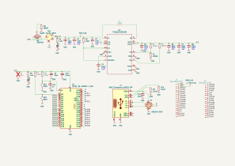
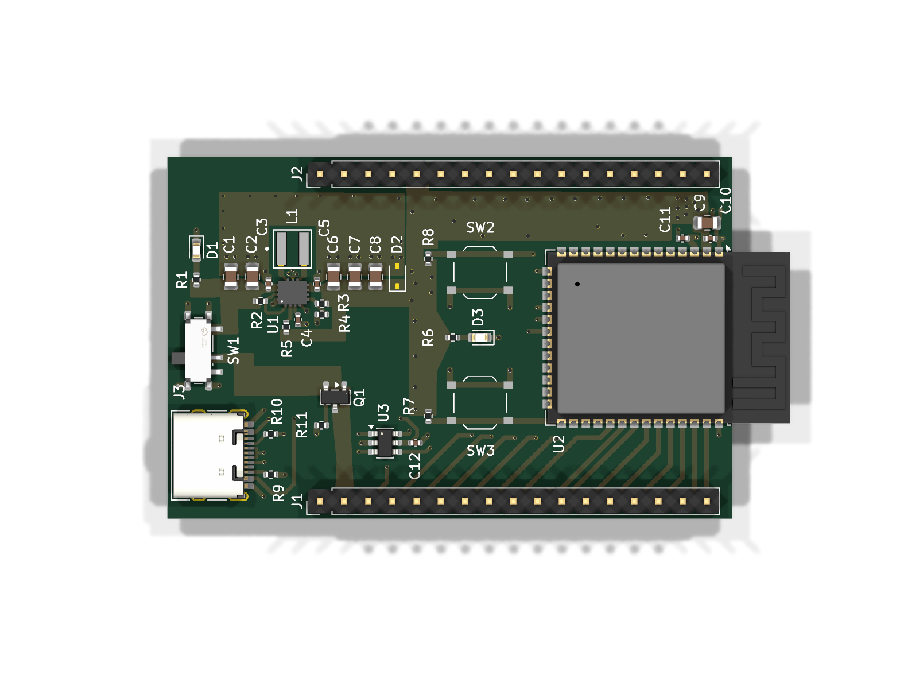
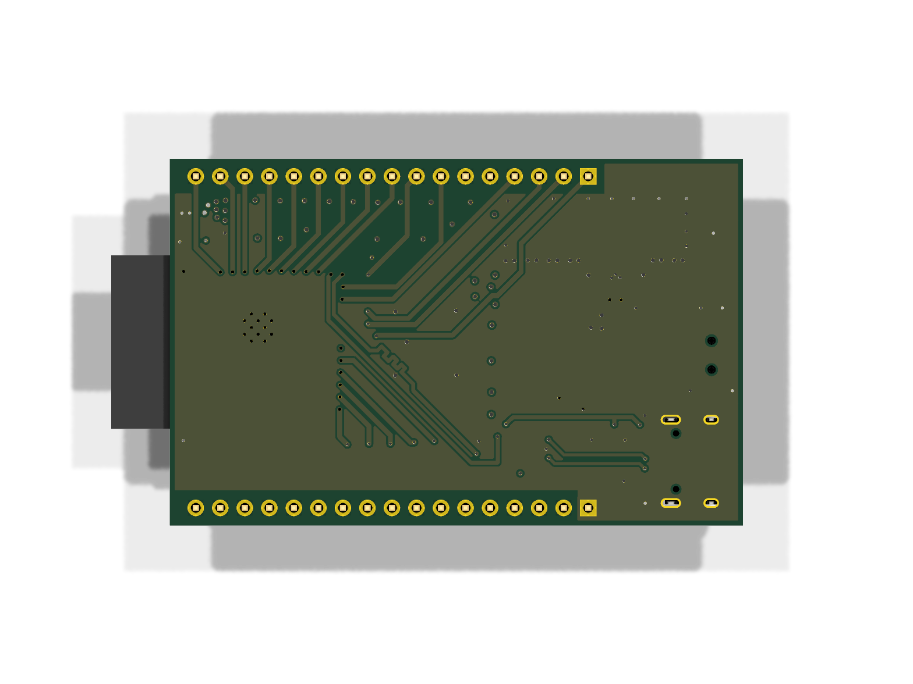

# ESP32-S3 DevKit

Development board built around the [ESP32-S3-WROOM-1](https://www.espressif.com/sites/default/files/documentation/esp32-s3-wroom-1_wroom-1u_datasheet_en.pdf) module with an integrated [TPS63070](https://www.ti.com/lit/ds/symlink/tps63070.pdf) buck-boost converter and USB-C connectivity.

## Specifications

- **MCU**: ESP32-S3-WROOM-1 (Wi-Fi + BLE, dual-core, 32-bit)
- **Power**: battery only — 3×AA (≈3.0–4.8 V) on the VBAT header pin, through reverse-polarity PFET (Q1) and power switch (SW1) into a TPS63070 buck-boost (3.3 V regulated output)
- **Interface**: USB-C (USB 2.0, 16-pin receptacle) — **data only, by design**; VBUS does not power the board. Batteries must be connected and SW1 on to flash.
- **ESD protection**: USBLC6-2SC6 on USB data lines
- **Layers**: 4
- **Thickness**: 1.6mm
- **Fab targets**: JLCPCB 4-layer advanced
- **Input voltage note**: the TPS63070 accepts up to 16 V, but C3 (10 µF 0402) is 6.3 V-rated — keep VBAT ≤ ~5.5 V unless C3 is upgraded (e.g. 0805/25 V)

## Key Components

| Ref | Value | Description |
|-----|-------|-------------|
| U1 | TPS63070RNMR | Buck-boost converter (3.3V output, adjustable) |
| U2 | ESP32-S3-WROOM-1 | Wi-Fi + BLE SoC module |
| U3 | USBLC6-2SC6 | USB ESD protection |
| J1, J2 | Conn_01x17 | GPIO breakout headers (J1 pin 2 = VBAT battery input) |
| J3 | USB-C 16P | USB-C receptacle (USB 2.0, data only) |
| L1 | 1.5µH | Buck-boost inductor (XFL4020-152ME) |
| Q1 | AO3401A | Reverse-polarity protection PMOS (drain to battery) |
| SW1 | MK-12C03-G015 | SPDT slide switch — main power (latching ON/OFF) |
| SW2 | RESET | Push — ESP32 reset |
| SW3 | BOOT | Push — boot / download mode |
| D1, D3 | LED | Status indicators (D2 zener: DNP) |

## Flashing

First flash: batteries in, SW1 on, hold BOOT, tap RESET, release BOOT, then flash over native USB (CDC/DFU). Subsequent flashes work over USB without buttons.

<!-- board-images-start -->
## Board Images

_Auto-generated on merge to main._

### Schematic

[Download schematic PDF](docs/schematic.pdf)

### PCB 3D Views

| Top | Bottom |
| :---: | :---: |
|  |  |

[Download populated 3D model (GLB)](docs/assembly.glb) — open in Blender or a glTF viewer.

<!-- board-images-end -->

<!-- drc-summary-start -->
## KiCad design checks

_Same layout as the KiCad check summary on pull requests (ERC, DRC, fab rules). Auto-generated on merge to main._

_No check reports in docs/ yet (run the update-readmes workflow on main)._

<!-- drc-summary-end -->

## Status

**In Development** — schematic and initial PCB layout complete. Not yet fabricated.
