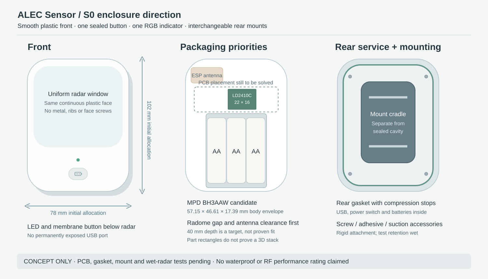

# Shower enclosure direction

## Product direction

Use a softly rounded vertical housing with a smooth front, a small RGB light pipe and one sealed mechanical button below the sensing area. A nominal **78 × 102 × 40 mm** body is a starting packaging allocation, not a dimensioned manufacturing design or demonstrated fit. The face has no exposed screws. A round puck remains possible, but the rectangular three-AA holder makes an elongated shape worth evaluating first.

Use the existing **MPD BH3AAW** as the initial holder candidate to keep the parts family consistent. Existing manufacturer CAD gives a 57.15 × 46.61 mm body and a 17.39 mm full height including the underside projection; its long leads need a real routing channel. Actual loaded cells, spring travel, wire bends, connector access and removal clearance remain unverified. See the [existing source drawing](../../enclosures/alec/sources/BH3AAW-drawing.pdf) and [parts register](../../enclosures/alec/parts/parts-register.json).

The manufacturer's LD2410C STEP measured **22.000 × 16.000 × 11.500 mm** overall, including its header. Its nominal PCB outline is 22 × 16 mm. Add the mating socket, positive retention and service clearance before claiming fit. The older English PDF has an inconsistent 7 × 35 mm parameter entry; the newer C manual and CAD identify the correct C dimensions. [Manufacturer downloads](https://www.hlktech.com/en/Goods-239.html).

The main PCB should lie parallel to the front/back surfaces, with the radar facing the front. Put the battery holder toward the lower portion and route its leads along a side channel. Do not place a converter directly behind the radar, and do not put a battery, mounting screw, copper plane or wiring in front of either antenna. The ESP32 antenna needs its own edge placement and manufacturer keepout in the eventual PCB/CAD assembly. Follow [Espressif’s module placement guidance](https://docs.espressif.com/projects/esp-hardware-design-guidelines/en/latest/esp32s3/pcb-layout-design.html#general-principles-of-pcb-layout-for-modules-positioning-a-module-on-a-base-board). No sensor PCB outline, mounting coordinates or component stack has been frozen yet.

## Radar window

Start with a uniform, unfilled, nonconductive plastic face. Unfilled polycarbonate is a candidate, subject to the exact grade, colorant, cleaners and dielectric data. No metallic finish, conductive pigment, carbon-filled material, ribs, bosses, labels with foil or coating in the aperture. Place the LED optics and button outside that aperture. The actual wet surface is part of the RF design.

At 24.125 GHz the free-space wavelength is approximately 12.43 mm. Hi-Link's module manual recommends evaluating a 12.4 or 18.6 mm antenna-to-inner-wall gap when space permits. Its separate guide also contains generic 3–5 mm installation advice; that is not a universal optimum. Make adjustable bench spacers and compare 4, 6.2, 12.4 and 18.6 mm before selecting depth. Keep the front's inner surface parallel to the antenna plane. [Hi-Link radome guide](https://r0.hlktech.com/download/HLK-LD2410C-24G/1/%E6%AF%AB%E7%B1%B3%E6%B3%A2%E4%BC%A0%E6%84%9F%E5%99%A8%E5%A4%A9%E7%BA%BF%E7%BD%A9%E8%AE%BE%E8%AE%A1%E6%8C%87%E5%8D%97_%E6%B5%B7%E5%87%8C%E7%A7%91.pdf).

Candidate wall thickness follows the wavelength **inside the material**, not in air: λmaterial = c / (f × √εr). For the guide's illustrative PC εr=3, half-wave thickness is about 3.59 mm and one-eighth wave about 0.90 mm. A random 2 mm plastic wall is not automatically transparent. Compare 0.8 mm and approximately 3.6 mm flat PC coupons from the actual candidate grade, then verify structural strength. These are experiment points, not released molding dimensions. Water film, soap, paint or a bonded lens changes the stack and needs another test.

“Without interference” becomes a measurable requirement: compared with the open sensor, dry and wet housings must preserve the intended zone and dwell performance within agreed limits. There is no zero-loss radome guarantee.

## Water and steam

Target **IP66 and IP67** testing of the complete assembled product, plus separate warm-humidity, condensation and cleaner exposure tests. Neither target is a current rating. Immersion resistance does not establish water-jet resistance. [Gore's application evidence](https://www.gore.com/resources/gore-protective-vents-ensure-rf-system-reliability-right-ip-rating-heavy-rain-conditions).

- Rear service cover with a continuous replaceable gasket, controlled compression stops and captive corrosion-resistant screws. Screw bosses sit outside the primary seal or are blind; no direct thread path through the sealed cavity.
- Battery contacts, USB-C, BOOT/RESET and the power switch inside that cover. Remove from the shower and dry before opening or attaching USB. Avoid an exterior USB opening and plug that can be left unsealed.
- Exterior button operated through a retained elastomer membrane/boot. The B3U electrical switch alone is not the waterproof boundary. The light pipe also needs an engineered bonded or compressed seal; do not leave an open indicator hole.
- Sloped drainage around the front perimeter and cradle; no upward-facing water traps at the gasket or button.
- Evaluate a protected hydrophobic/oleophobic pressure vent on a downward-facing rear surface. Select the membrane, attachment and area as one assembly. A vent can help pressure equalization and drying but passes water vapor; it does not guarantee dry internal air. Compare vented and unvented mockups through thermal/humidity cycles. [Gore pressure-vent guidance](https://www.gore.com/products/pressure-vents-portable-electronics).
- Dry assembly, clean boards and compatible conformal coating can provide secondary protection. Mask radar/ESP32 antenna areas, contacts, switches and connectors as required; do not coat the radar antenna without vendor support and RF tests. Coating does not replace the gasket.

## Mounts

Use a detachable rear cradle outside the sealed boundary. Offer a screw-fixed wall plate, a wet-environment adhesive plate and a suction accessory that share the same retaining interface. A screw mount must not compromise the shower's wall waterproofing; its attachment method depends on the wall system. No cradle fastener enters the electronics cavity.

The mount must hold the radar rigidly. A flexible suction stalk can turn housing movement into a radar target. Evaluate a broad, short suction interface and secondary retention, and test it with soap, warmth and the actual tile finish. Suction is a removable option, not a guarantee on textured tile or grout. Keep any metal, magnets and retention hardware behind the device and out of the ESP32 keepout; verify their RF effect rather than assuming the back is invisible to the radar.

## Before a PCB outline is committed

Select and measure the actual radar/header, holder, loaded cells, button membrane, light-pipe seal, gasket cross-section, DC power switch, current protection and mount latch. Build a parametric CAD stack with tolerance and service sweeps. Then place both antennas and the converter regions together. The sketch deliberately carries no fake PCB or finished assembly model.
