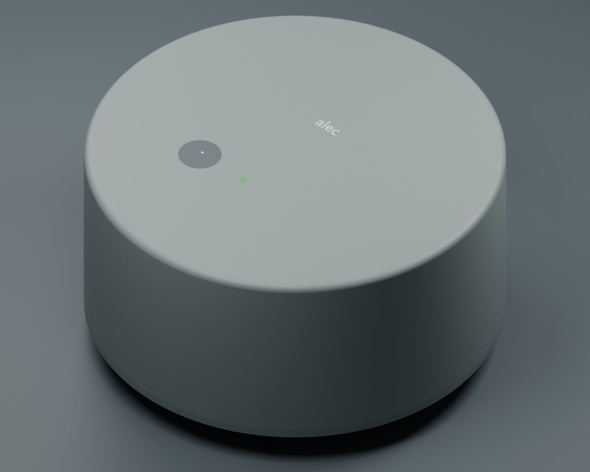
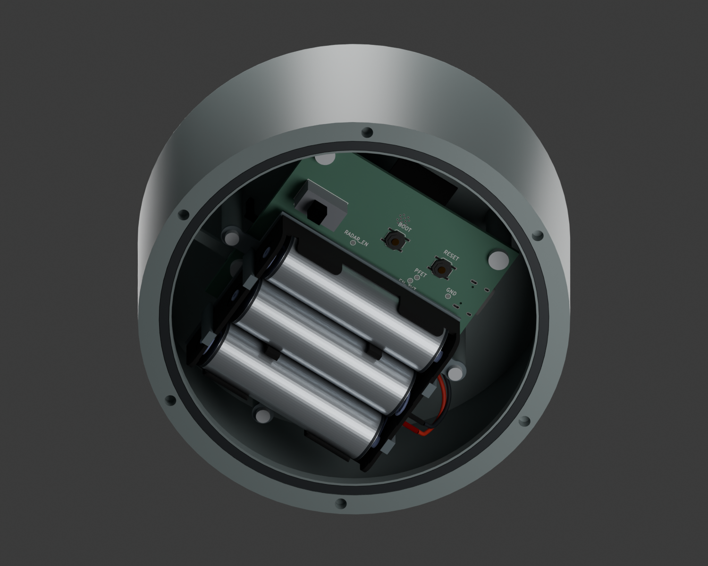
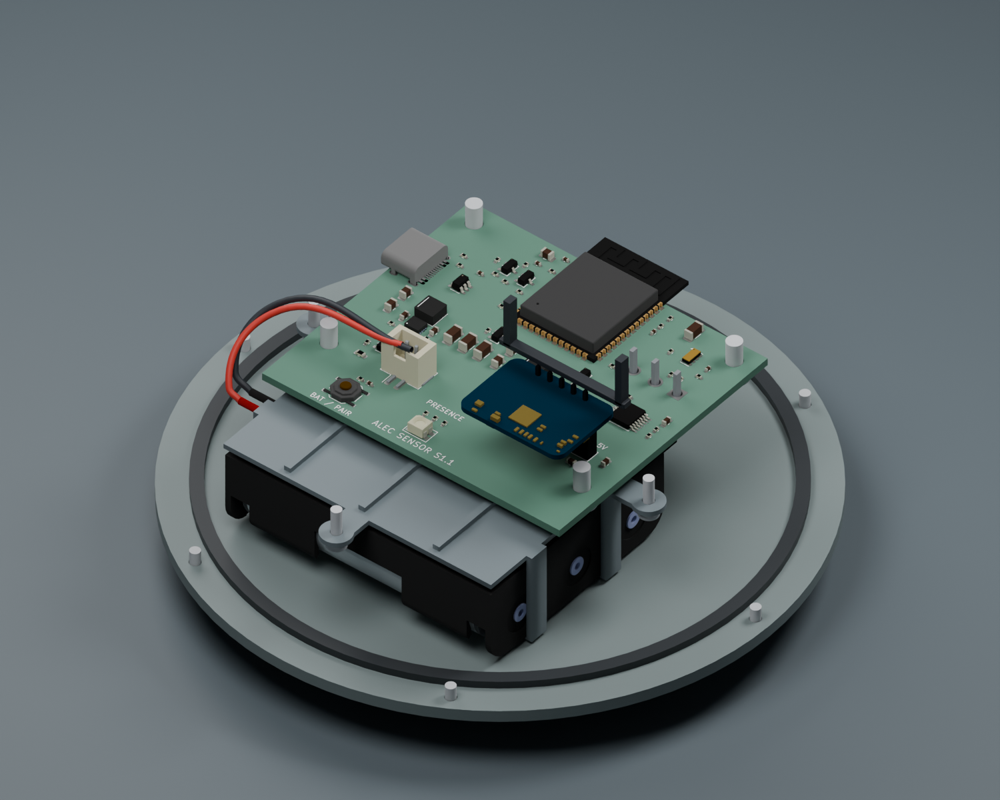

# ALEC Sensor — circular S1.1 enclosure

**116 mm diameter × 54 mm body**, with a separate external mounting cradle. This is a dimensioned engineering prototype around the routed ALEC Sensor PCB, MPD BH3AAW three-AA holder and Hi-Link LD2410C. It follows the preferred circular shape with a rounded shoulder, one visible presence LED and one membrane-covered battery/pairing button.







- [Editable complete Blender assembly](alec-sensor-s1.blend)
- [Mechanical STEP assembly](alec-sensor-s1-mechanical.step), [individual STEP parts](cad/)
- [Actual populated PCB GLB](../../boards/alec-sensor/docs/assembly.glb)
- [Dimensions and interface](interface.json), [nominal CAD checks](cad-checks.json), [geometry provenance](sources/provenance.json)
- [Electrical and mechanical test report](../../boards/alec-sensor/TEST-REPORT.md)
- [Rear service bay with batteries installed](rear-service.png), [PCB underside only](pcb-service.png)

The Blender assembly imports the **actual routed PCB** and **manufacturer radar and battery-holder geometry**. The holder's original straight 150 mm leads are cropped to short stubs; the bent harness is an explicit allocation. AA cell envelopes are 14.5 × 50.5 mm. Housing, plunger, membrane, light pipe, cradle, fasteners and radar-retention clip are custom prototype geometry or marked allocations. Radar colors are illustrative; the imported geometry comes from Hi-Link STEP.

**Routine service is through the screw-fastened rear cover.** The AA holder opens rearward, and POWER, RESET and BOOT face the same opening in a clear area beside it. The holder is retained by an internal carrier with three M2 mounts and four nominal nylon edge hooks; removing the cover leaves the holder, harness and PCB installed. The external battery/pairing button remains under its front membrane.

The PCB lies flat between the rear batteries and front radar. Nominal clearance is 1.29 mm at the holder's outermost corner through the rear opening, 3.61 mm to the PCB underside and 1.61 mm to the PCB screw heads. The carrier adds a 1 mm support plate and 1 mm ribs; nominal rib-to-PCB clearance is 1.61 mm, and plate-to-PCB-screw-head clearance is 0.61 mm. These close dimensions require a tolerance review and physical sample. The radar front copper plane has a 12.4 mm gap to the 3.6 mm PC face. The lower-right PCB support ends below the radar and uses a side rib.

A rear O-ring and front silicone membrane provide a **proposed sealing architecture**. Neither the CAD checks nor this render establishes waterproofing. Gland tolerances, compression force, material grades, blind inserts, battery-holder retention, radar clip retention and the membrane's force/travel/fatigue need engineering samples. The light indication uses an unpainted/transmissive area of the same front wall, not an open LED hole. The sealed prototype has no pressure vent; evaluate condensation and pressure cycling before deciding whether a qualified vent is needed.

Dry the unit, release it from the wall cradle and remove the six rear-cover screws to replace cells or reach POWER/RESET/BOOT. No PCB removal is needed for those operations. **USB remains engineering service:** J2 retains its reviewed signal routing and front-side location; cable insertion can still require removing the battery carrier and lifting the PCB. Do not force a cable against the enclosure wall. The external mounting cradle keeps mounting penetrations outside the sealed cavity. Screw, adhesive and suction adapters share that interface; actual suction/adhesive parts and load tests remain open.

This is a **fit prototype**, not a production machining or injection-molding release. The internal guides/supports include undercuts; review manufacturing splits with the prototype supplier. No PCB or enclosure order has been placed.

## Free tools and reproduction

Use CadQuery **2.8.0**, Blender **5.2.1 LTS** and KiCad **10.0.x**. From the repository root:

```sh
python enclosures/alec-sensor/tools/build_cad.py
blender -b --python enclosures/alec-sensor/tools/build_blender.py
```

`build_cad.py` regenerates STEP/STL geometry and fails on 19 explicit solid/approach intersection checks, including control access with the holder and carrier installed. `build_blender.py` imports the latest PCB GLB; generate board images first using the [board runbook](../../boards/alec-sensor/tools/README.md). The committed radar GLB avoids requiring a vendor download to rebuild. `prepare_sources.py <HLK-LD2410C.step>` reproduces that conversion; provenance records its source hash.
