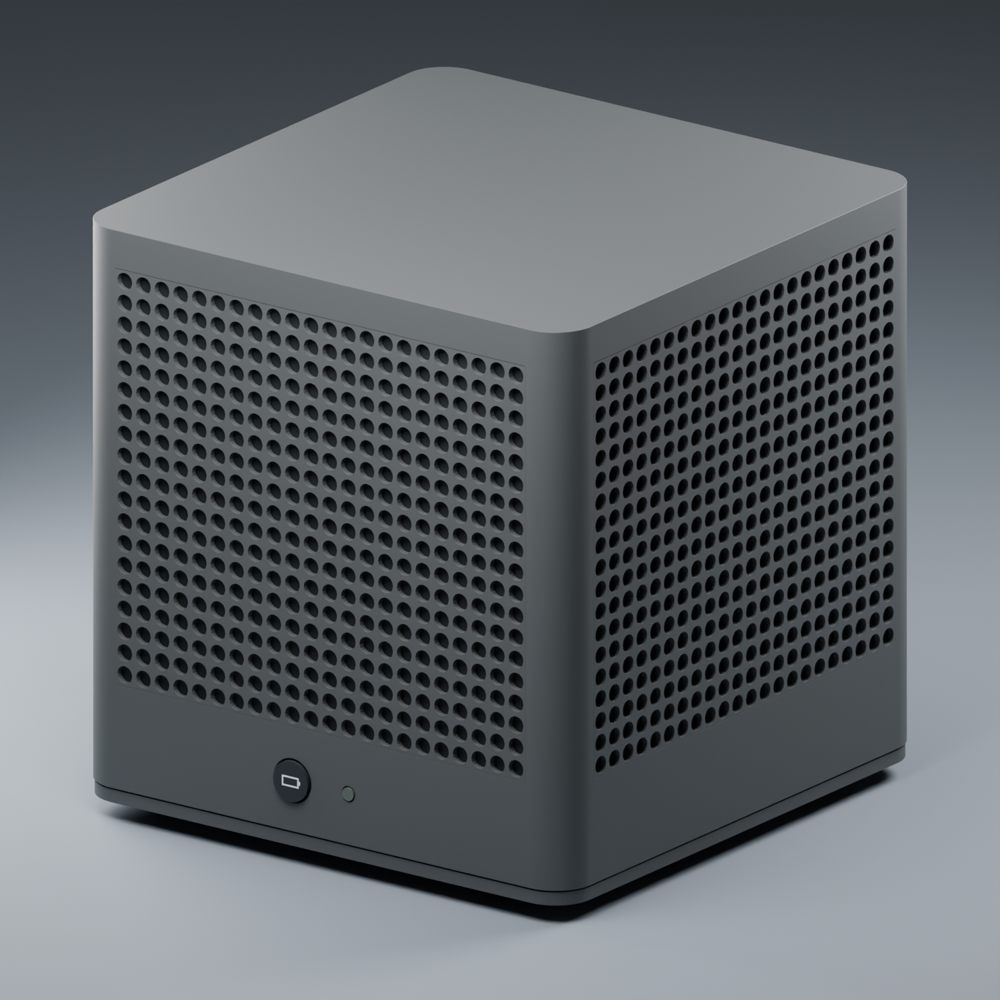
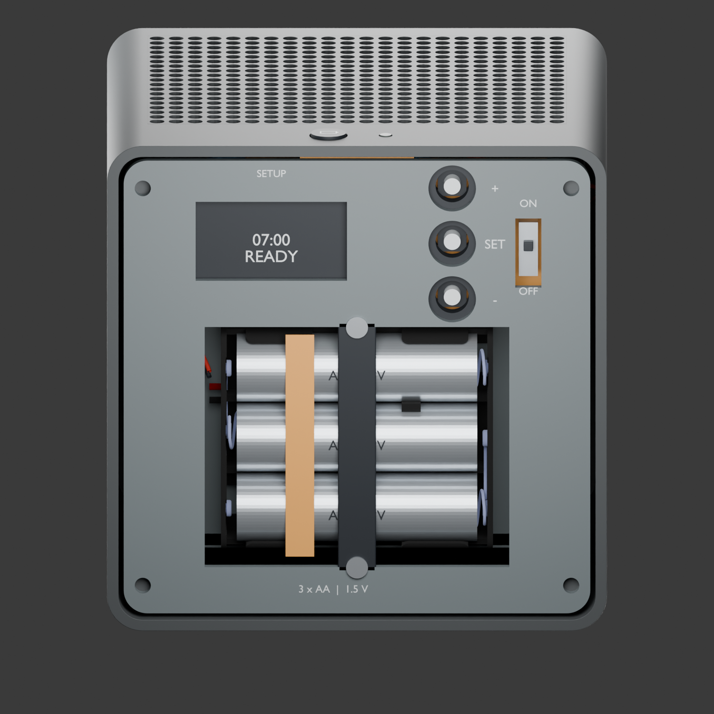

# ALEC enclosure — v4.1

The enclosure-specific routed PCBs and integrated assembly are in the [v4.2 PCB revision](pcb-revision/README.md). The v4.1 files below remain the original packaging reference.

A 105 mm bedside alarm enclosure with four perforated walls, a front-facing Visaton FRS 5 X speaker in its own rear pod, three AA cells, a flat main PCB, one exterior battery-check button and one indicator lens. The screw-fastened bottom cover hides the settings controls, power-enable switch and **EastRising ER-OLEDM013-1W-I2C 1.3-inch OLED**. The shower sensor is a separate unit.

**Packaging prototype.** Saved-scene geometry checks pass; purchased-part fit, manufacturing tolerances, firmware integration, acoustics, RF, battery load/cooling, EMI and parasitics remain unqualified. The control and front UI boards are allocations that still need electrical design. The actual [esp32s3-devkit-5v PCB](../../boards/esp32s3-devkit-5v/) and its buck-boost layouts are unchanged.





## Open the design

| Deliverable | Purpose |
|---|---|
| [Assembled Blender model](alec-cube-v4-1.blend) | Full editable assembly, including the actual imported PCB and holder meshes |
| [Bottom service model](alec-cube-v4-1-service.blend) | Bottom cover removed; larger display and hidden settings controls |
| [Internal assembly](alec-cube-v4-1-internals.blend) | Outer walls hidden; speaker pod remains closed |
| [Acoustic cutaway](alec-cube-v4-1-acoustic-cutaway.blend) | One pod wall and roof hidden for inspection |
| [Clearance view](alec-cube-v4-1-clearances.blend) | RF, motion and provisional component envelopes |
| [Dimensioned drawing](dimensioned-layout.svg) | Millimetre datums and arrangement |
| [Display update](DISPLAY-UPDATE.md) | Exact part, old/new dimensions, small placement changes and remaining checks |
| [Design review](DESIGN-REVIEW.md) | Product decisions, acoustics, assembly and behavior contract |
| [Test report](TEST-REPORT.md) | Completed geometry checks and unrun physical test plan |
| [PCB interface brief](PCB-INTERFACE.md) | Signal mapping and proposed control-board interfaces |
| [Parts register](parts/README.md) | 27 mechanical items and all 111 populated PCB references |

Download the `.blend` files to open them in Blender; GitHub does not render Blender scenes. Each file embeds its geometry. The PNG previews display directly in this README without a merge-time rendering service. [index.html](index.html) is an optional local gallery: open it from a checkout/download containing the adjacent images; GitHub displays its source.

## Reproduce

Free tools: Blender **5.2.1 LTS** (the version used for this review) and Python 3. No paid add-ons, external fonts or image textures are required. Use Blender from its official distribution and make `blender` available on your PATH. On macOS its default executable is `/Applications/Blender.app/Contents/MacOS/Blender`; substitute that path in the commands below if needed.

From `enclosures/alec/`:

```sh
# Rebuild all five saved scenes and six rendered views.
blender --background --python-exit-code 1 --python build_blender.py

# Independently reopen the saved assembly and compare it with the committed v4 reference.
blender --background --python-exit-code 1 --python verify_assembly.py

# Rebuild the Markdown report, SVG drawing, HTML gallery and source manifest.
python3 build_report.py
python3 parts/update_register.py
python3 parts/check_fit_readiness.py
```

`check_fit_readiness.py` currently exits **2**, intentionally: exact part/hardware sign-off and physical tests remain open. Zero inventory errors is expected. It is a readiness guard, not a collision solver. `build_report.py` preserves an existing `physical-test-log.csv`; enter measured results there without replacing them on every rebuild.

Set `CUBE_SKIP_RENDER=1` for a faster geometry-only build; that does not refresh the PNG previews. For publishing a changed design, run the full build. The generated SVG is the authoritative dimensioned drawing; optionally refresh its PNG preview with the free Inkscape CLI:

```sh
inkscape dimensioned-layout.svg --export-type=png --export-filename=dimensioned-layout.png
```

The native PCB, its GLB and `parts/pcb-evidence.json` must agree. If the native PCB changes, regenerate the KiCad GLB and re-audit the assembly before accepting new fit evidence. `parts/collect_pcb.py` uses KiCad's Python/`pcbnew` environment to refresh PCB inventory; it does not refresh the GLB or automatically approve changed geometry.

## Evidence and CI scope

`verification.json` binds the geometry results to the saved assembly SHA-256. `source-manifest.json` records manufacturer inputs and the original v4 comparison scene; [sources/README.md](sources/README.md) documents provenance. [reference/README.md](reference/README.md) explains the preserved v4 baseline, which works without Git history or ignored local folders.

The repository's existing pytest job checks asset/source hashes, local documentation/gallery links, PCB evidence consistency, the readiness register and report regeneration from this tracked directory. It does **not** install Blender or repeat physical testing. Run the Blender verifier locally after geometry changes and commit the refreshed evidence. Passing these checks does not qualify the product for manufacturing.
