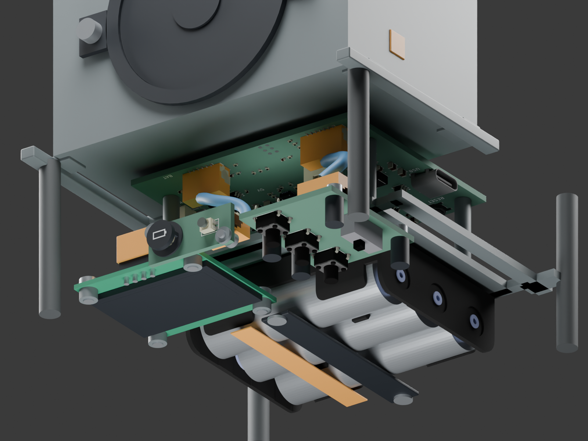
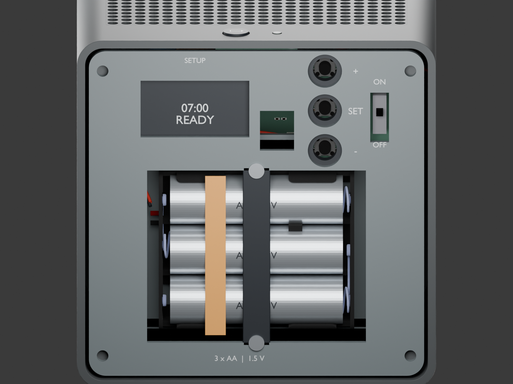

# ALEC v4.2 — integrated PCB prototype

The v4.1 enclosure now has three actual routed KiCad boards. The 105 mm exterior, four perforated walls, front-facing Visaton FRS 5 X, MPD BH3AAW holder and EastRising 1.3-inch display remain in place. The original v4.1 model remains a separate reference.

- [Complete Blender assembly](alec-cube-v4-2.blend)
- [Internal inspection view](alec-cube-v4-2-internals.blend)
- [Protected bottom service view](alec-cube-v4-2-service.blend)
- [Test report](TEST-REPORT.md), [geometry results](verification.json), [source hashes](assembly-sources.json)
- [Main PCB](../../../boards/alec-main/README.md), [bottom controls](../../../boards/alec-controls/README.md), [front controls](../../../boards/alec-front/README.md)

The main PCB stays 64 × 56 mm with its original mounts and converter placement. Its five user switches and RGB LED move to the controls boards; RESET and BOOT remain for bench service. A 27 × 34 mm bottom board carries the three 7 mm B3F-1060 actuators and EG1218 enable switch. A 24 × 10 mm front board carries the B3U-1000P battery-check button and the existing common-anode Wuerth RGB LED. All boards are 1.6 mm thick; the main board has four copper layers and the controls boards have two.

Four 100 Ω resistors limit capacitor-discharge current and damp the remote button circuits. The original 10 kΩ pullups, 100 nF debounce capacitors and RGB current-limiting resistors remain on the main PCB. The upper panel button is VOL+ (GPIO6), the middle is MODE (GPIO5), and the lower is VOL− (GPIO4). The exterior button remains GPIO10.

The bottom cover still needs screws removed. The extra 10 × 12 mm opening in the protected setup panel gives an 8 × 10 mm spring-probe fixture corridor to six UART programming pads. J7 is fabricated copper, excluded from the assembly BOM. Its 3.3 V contact is a target-voltage reference, not an external power input. The custom fixture still needs its own mechanical registration design; USB remains available when the main PCB is on the bench.

Use two distinct keyed JST GH cables, maximum 200 mm each, with 1:1 pin continuity. Pin numbering is defined by the connectors, not by left-to-right wire colors in a photograph. See the [harness contract](../../../boards/alec-main/HARNESS.md). OFF is regulator standby, not a battery disconnect. Unplugging the controls board also selects standby through R32.

This is an engineering prototype, not a manufacturing release. Amber plug/cable/light-pipe envelopes remain allocations. The front cap has an integral retaining flange, clearance around the upper mounting boss, and a nominal 0.055 mm stem gap to the exported switch. Print tolerances, B3U pretravel tolerance, overtravel stops, optical diffusion, purchased fasteners, connector cable bends, acoustics, ESP-NOW range and continuous-alarm temperatures still require physical checks. A 0.055 mm CAD gap is too small to treat as a guaranteed printed-part tolerance.

The extra boards and four GH headers improve assembly/service access but add BOM and harness labor. This revision is not the lowest-cost production implementation; panelization, crimped cable sourcing and a possible consolidated production board follow prototype verification.

Rebuild with free tools: run `scripts/alarm/export_review.py` from the repository root, then use Blender in background mode with `build_assembly.py`, `verify_assembly.py`, and `render_views.py`. These scripts consume the actual PCB exports and saved v4.1 assembly. Rebuilding the complete assembly invalidates its previous verification hash until the verifier runs again.
